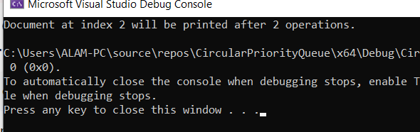

# circular-priority-queue
C++ implementation of Circular Priority Queue (Printer Scheduling Problem)
# Circular Priority Queue (Printer Scheduling Problem)

## 📌 Description
This project implements a Circular Priority Queue in C++ to simulate a printer scheduling system. Documents are printed based on priority, and we calculate when a specific document will be printed.

## 💻 Features
- Circular Queue implementation
- Priority-based scheduling
- Efficient max priority search
- Simulation of printer queue system

## 🛠 Language Used
- C++

## 📂 File
- main.cpp

  
## 📸 Output Screenshot

## 🚀 How to Run
1. Open project in Visual Studio
2. Build Solution
3. Run (Ctrl + F5)

## 🔗 Connect with Me
- LinkedIn: https://www.linkedin.com/in/sawera-cs
- GitHub: https://github.com/sawera-cs
